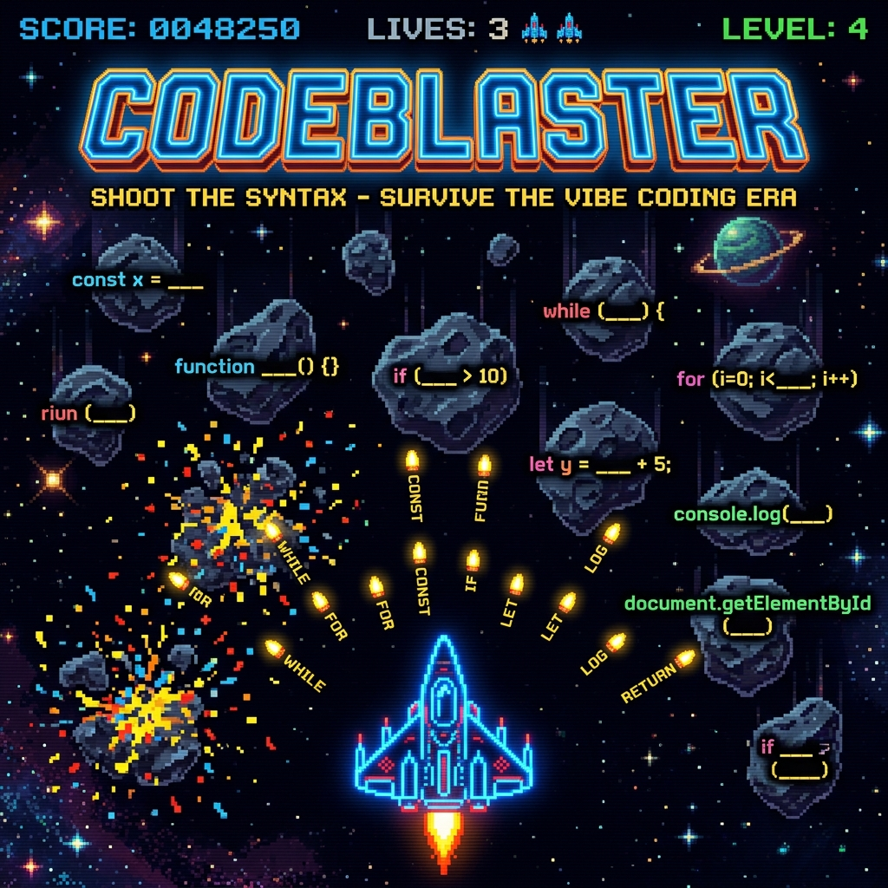

<p align="center">
  
</p>

# 🚀 CodeBlaster

> Shoot the syntax · Survive the vibe coding era — an arcade game where code asteroids rain down and you blast them with the correct keyword.

**Think Space Invaders meets LeetCode.** Asteroids fall with code snippets that have a missing keyword — pick the right answer to fire it into the blank and destroy the asteroid. Miss 3 and it's game over.

---

## ✨ Features

- 🎮 **Full arcade experience** — Canvas-rendered spaceship, asteroids, particles, confetti explosions
- 💻 **9 languages** — Python, TypeScript, Go, Rust, C#, JavaScript, SQL, MongoDB
- 🌌 **5 Background Themes** — Universe, Highway, Ocean, Matrix, Aurora
- 🧠 **Play & Learn Modes** — Stress-free learning with revealed answers or classic arcade survival
- 🛠️ **Drill My Mistakes** — Replay only the questions you missed to master the syntax
- 🔥 **Combo system** — Chain correct answers for streak multipliers up to 8×
- ❤️ **Lives & levels** — 3 lives, progressive difficulty (Beginner/Intermediate/Expert)
- ⚡ **Speed control** — 5 speed settings from "very slow" to "insane"
- 🎯 **Keyword bullets** — Your answer literally flies from your ship into the asteroid's blank slot
- 🌟 **Zero dependencies** — Single HTML file, no build step, no npm, just open in a browser

---

## 🎯 How to Play

```bash
# Just open it in any browser
start codeblaster.html        # Windows
open codeblaster.html         # macOS
xdg-open codeblaster.html     # Linux
```

### Controls

| Action | How |
|--------|-----|
| **Steer ship** | Move your mouse |
| **Answer** | Click a button or press `1-4` keys |
| **Speed** | Adjust the slider at the bottom |

### Gameplay

1. An asteroid falls with code like `const x = ___ fetch(url)`
2. Four answer buttons appear: `await`, `async`, `yield`, `defer`
3. Click the right one → keyword bullet flies from your ship into the blank
4. **Correct** → asteroid explodes with confetti 🎊, score multiplied by combo
5. **Wrong** → you lose a life ❤️, asteroid shakes red
6. **Missed** → asteroid hits the bottom, you lose a life

---

## 🧠 Question Bank

| Language | Questions | Color |
|----------|-----------|-------|
| Python | `range`, `open`, `is`, `Optional`, `staticmethod`, ... | 🟢 Green |
| TypeScript | `string`, `Array`, `unknown`, `=>`, `enum`, ... | 🔵 Cyan |
| Go | `if`, `WaitGroup`, `make`, `struct`, `defer`, ... | 🔷 Blue |
| Rust | `i32`, `->`, `Display`, `Vec`, `let`, ... | 🔴 Red |
| C# | `static`, `Delay`, `null`, `record`, `FirstOrDefault`, ... | 🟡 Yellow |
| JavaScript | `await`, `map`, `const`, `??`, `Promise.all`, `yield`, ... | 🟣 Purple |
| SQL | `SELECT`, `JOIN`, `GROUP BY`, `HAVING`, `WHERE`, ... | 🟥 Pink |
| MongoDB | `findOne`, `aggregate`, `updateOne`, `$match`, ... | 🟩 Green |

---

## 🏗️ Architecture

Single-file, zero-dependency game — everything in one `codeblaster.html`:

```
codeblaster.html
├── HTML — HUD, start screen, game over screen, choice buttons
├── CSS — Dark arcade theme, Orbitron font, neon animations
└── JavaScript (~1900 lines)
    ├── Canvas rendering (ship, asteroids, bullets, particles, stars, backgrounds)
    ├── Physics (wobble, gravity, easing, collision)
    ├── Question bank (400+ questions across 9 languages)
    ├── Scoring (combos, streaks, levels, high score)
    └── Game state machine (idle → playing → over)
```

---

## 🔧 Requirements

- Any modern browser (Chrome, Firefox, Edge, Safari)
- That's it. Seriously.

---

## 📄 License

[MIT](../LICENSE)
