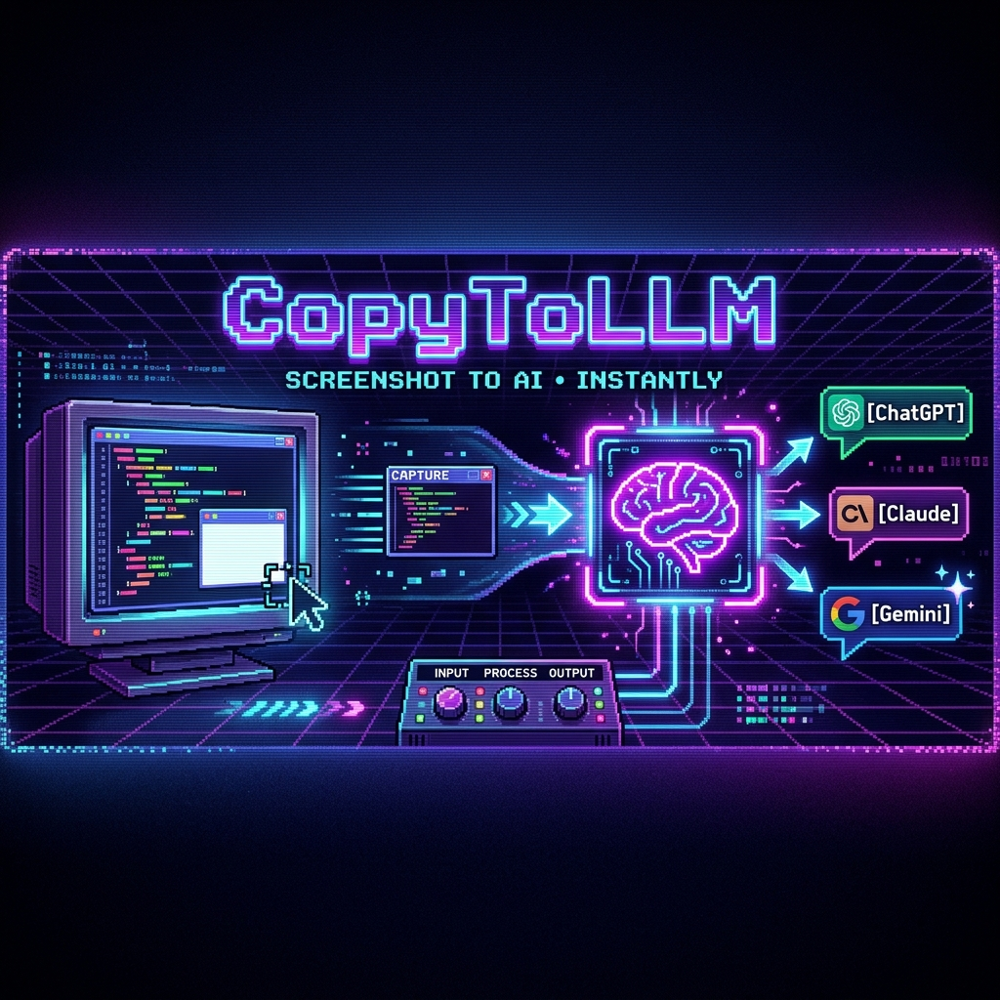

<p align="center">
  
</p>

# 📋 CopyToLLM

> One hotkey to capture any screen region and paste it directly into ChatGPT, Claude, or Gemini — image + analysis prompt, fully automated.

**`Ctrl+Shift+S`** → Capture → Choose AI → Done. No saving files, no alt-tabbing, no friction.

---

## ✨ Features

| Capture Mode | How to Trigger |
|-------------|----------------|
| **Custom Region** | Drag a box around anything |
| **Auto Element** | Click on any UI element (uses Windows UI Automation to detect bounds) |
| **Scroll Capture** | `Alt+Click` on a scrollable area — auto-scrolls and stitches a full-length screenshot |
| **Full Screen** | Double-click anywhere |

After capture, a quick-picker menu lets you choose your AI:
- 🧠 ChatGPT
- 🎨 Claude  
- ✨ Gemini

The tool opens the AI in Chrome, pastes the image, then pastes an analysis prompt — all automatically.

---

## 🏗️ Architecture

```
Program.cs                 → Entry point, starts hidden background app
AppLogic.cs                → Hotkey registration (Ctrl+Shift+S), orchestration
SnippingOverlayForm.cs     → Full-screen transparent overlay for region selection
UIElementCapture.cs        → Windows UI Automation element detection + screenshot
ScrollCaptureEngine.cs     → Auto-scroll + pixel-level image stitching engine
PayloadDelivery.cs         → Clipboard automation + browser delivery + AI picker
```

**Zero external dependencies.** Pure .NET 9 + Windows Forms + WPF + Win32 interop.

---

## 🚀 Usage

```bash
dotnet run
```

The app runs silently in the background. Press **`Ctrl+Shift+S`** anywhere to activate.

### Controls (on the overlay)

| Action | Result |
|--------|--------|
| **Drag** | Custom region capture |
| **Click** | Auto-detect UI element bounds |
| **Alt+Click** | Scroll capture (stitches scrollable content) |
| **Double-click** | Full screen capture |
| **Right-click** | Cancel |

---

## 🔧 Requirements

- Windows 10/11
- .NET 9 SDK
- Chrome (for auto-delivery to AI chats)

---

## 🧠 How Scroll Capture Works

The scroll capture engine is the crown jewel. When you `Alt+Click` a scrollable element:

1. Detects the element's bounding rectangle via UI Automation
2. Captures the initial frame
3. Sends `WM_MOUSEWHEEL` events to scroll down
4. Captures each new frame after scrolling
5. Uses **pixel-level Mean Absolute Error (MAE)** matching to find the exact overlap between frames
6. Stitches frames together, preserving headers and footers
7. Repeats until the content stops scrolling (identical frames detected)

The result is a single, seamless, full-length screenshot of any scrollable content — code editors, web pages, documents, chat logs, anything.

---

## 📄 License

[MIT](../LICENSE)
