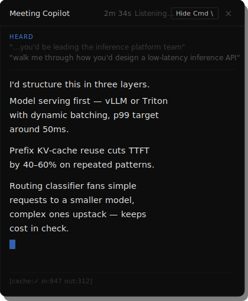
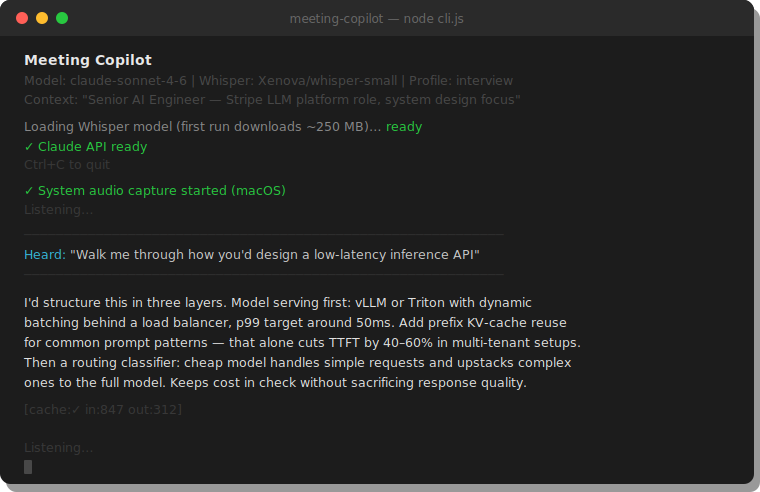

# Meeting Copilot

A personal AI meeting assistant that sits as a transparent overlay during Zoom/Teams calls. It listens to the other speaker, transcribes their speech locally with Whisper, and streams a concise talking point from Claude the moment they pause — so you always have something clear and confident to say.

## 🌍 Multilingual — the standout feature

**The other person can speak any language. You always see English.**

Chinese, French, Hindi, Arabic, Spanish, Japanese, German — or any of the ~100 languages Whisper understands — Meeting Copilot transcribes and translates to English in real time. No translation API, no extra cost, no added latency. Whisper's built-in `translate` task does speech recognition and English translation in a single pass.

This is on by default. Toggle it off in the setup screen for English-only meetings.

---

## Overlay (Electron desktop app)



## CLI (terminal)



---

## How it works

1. Before the meeting: paste context (agenda, your role, talking points) into the text area
2. Start session — the overlay appears
3. The other person speaks → Whisper transcribes (+ translates to English if needed) → Claude streams a suggested reply
4. Glance at the overlay, adapt, keep talking

Context is sent once as a **cached system prompt** — only the live transcript changes per API call, so latency and cost stay low.

---

## Setup

### 1. Install

```bash
cd MeetingCopilot
npm install
npm start
```

Requires Node 18+. `ffmpeg` is bundled automatically via `npm install` — no separate ffmpeg install needed.

### 2. Claude API key

Get one at [console.anthropic.com](https://console.anthropic.com/settings/keys). Paste it into the setup screen and pick a model (Sonnet 4.6 recommended, Opus 4.8 for best quality).

### 3. System audio setup (per platform)

System audio capture is required so Meeting Copilot hears the other person — not you.

#### macOS

Two modes for macOS system audio:

**Gemini / BYOK mode** — uses the built-in `SystemAudioDump` binary. No extra software. Grant **Screen Recording** permission on first launch (System Settings → Privacy & Security → Screen Recording).

**Claude API / Ollama mode** — uses ffmpeg with BlackHole.

1. Install **BlackHole 2ch** (free, open-source):  
   https://existential.audio/blackhole/

2. Open **Audio MIDI Setup** → create a **Multi-Output Device** that includes both BlackHole 2ch and your speakers/headphones.

3. Set the Multi-Output Device as your system audio output before joining the call.

> BlackHole routes a copy of system audio to Meeting Copilot while you still hear it normally.

#### Windows

**Gemini / BYOK mode** — no extra software. The Electron audio handler uses WASAPI loopback automatically.

**Claude API / Ollama mode** — Meeting Copilot tries WASAPI loopback automatically. If your audio card doesn't support loopback natively, install **VB-Cable** (free):  
https://vb-audio.com/Cable/

After installing VB-Cable, set **CABLE Input** as your default audio output in Windows Sound settings, then set CABLE Output as your recording input.

#### Linux

```bash
# PulseAudio / PipeWire (default on Ubuntu 20.04+)
pactl list sources short        # find your monitor source name
# Meeting Copilot uses default.monitor automatically
```

If your PulseAudio monitor source has a custom name, set the environment variable before launching:
```bash
PULSE_SOURCE=alsa_output.pci-0000_00_1f.3.analog-stereo.monitor npm start
```

---

## Modes

| Mode | What it uses |
|------|-------------|
| **Claude API** (recommended) | Claude API + local Whisper transcription. Best quality, no system audio compromise. |
| **Local AI** | Ollama LLM + local Whisper. Fully offline, slower without a GPU. |
| **Gemini BYOK** | Gemini Live API — no extra audio setup on macOS, cloud transcription. |

---

## CLI

Run the full pipeline directly from terminal — no Electron needed:

```bash
# Default: any language → English
node cli.js --key sk-ant-... --context "Q4 planning meeting — budget review, roadmap sign-off"

# Web overlay on your phone/tablet (same WiFi)
node cli.js --key sk-ant-... --serve

# English-only mode (skip translation step)
node cli.js --key sk-ant-... --lang en

# All options
node cli.js start --help
```

**Platform audio:**
- macOS: system audio (Teams/Zoom output) by default
- Windows: WASAPI loopback (built-in) or VB-Cable
- Linux: `--loopback <pulse-monitor-device>` for system audio, or `--mic`
- Android/Termux: `--mic` + `--serve` to view on phone

---

## Quick demo (no microphone needed)

1. Start in Claude API mode with your key
2. Click **Start Session**
3. Type a question in the bottom text bar and press Enter
4. Claude's suggested reply streams in the overlay

---

## Keyboard shortcuts

| Shortcut | Action |
|----------|--------|
| `Cmd/Ctrl+\` | Show/hide overlay |
| `Cmd/Ctrl+M` | Toggle click-through |
| `Cmd/Ctrl+Enter` | Analyze screen |
| `Cmd/Ctrl+[` / `]` | Previous/next response |
| `Cmd/Ctrl+Shift+Up/Down` | Scroll response |

---

## Profiles

| Profile | Best for |
|---------|---------|
| **Meeting** (default) | Team meetings, standups, discussions |
| **Sales** | Client calls, business development |
| **Presentation** | Pitches, demos, public talks |
| **General** | Any professional conversation |

---

## Trial & License

Meeting Copilot runs free for 25 days. After that a licence is required.

Source is available under the [Business Source License 1.1](./LICENSE). The source becomes fully open on 2029-01-01.
