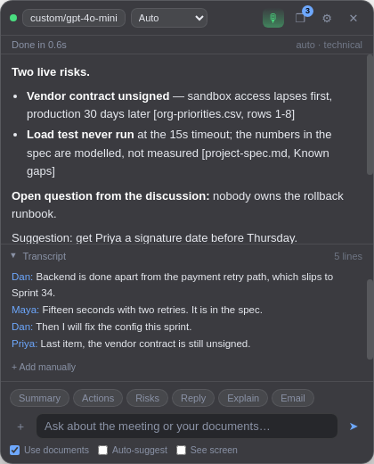
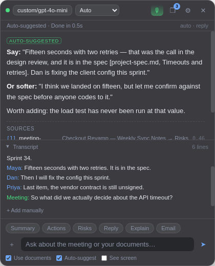
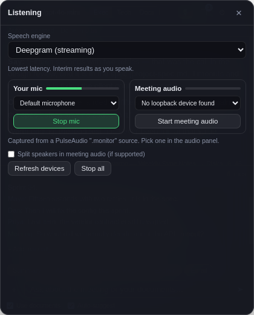
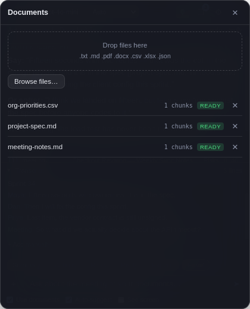

# Stealth Meeting Assistant

A capture-protected Electron overlay that floats above your meeting, answers questions from
your attached documents and the live transcript, and works with **any** LLM provider you have
a key for — switchable mid-meeting without restarting.

Local-first: documents, embeddings and transcript never leave your machine except in the
prompt you send to the provider you chose.

```
┌──────────────────────────────────────────────┐
│ ● openai/gpt-4o-mini  [Exec|Tech|Docs]  ❐ ⚙ ✕│
├──────────────────────────────────────────────┤
│ Done in 1.2s                                 │
│                                              │
│ Risks                                        │
│ • Vendor contract unsigned — sandbox access   │
│   lapses first [project-spec.md, Known gaps] │
│ • Load test never run at 15s timeout          │
│                                              │
│ Sources                                      │
│ [1] project-spec.md  Known gaps        0.61  │
├──────────────────────────────────────────────┤
│ ▸ Transcript                        9 lines  │
├──────────────────────────────────────────────┤
│ Summary Actions Risks Reply Explain Email    │
│ ＋ [ Ask about the meeting…            ]  ➤  │
└──────────────────────────────────────────────┘
```

---

## Screenshots

Real captures of the running overlay (`npm run screenshots`), not mockups — see
[`docs/screenshots`](docs/screenshots).

| | |
|---|---|
|  |  |
| Streamed answer, sources cited by file and section | Auto-suggested reply, drafted when the other side asked a question |
|  |  |
| Live capture, per-source level meters | Indexed documents with chunk counts |

## Install on Windows

```
Download MeetingAssistant-Setup-<version>.exe  →  run it  →  done
```

The installer is built by CI on a Windows runner (Actions →
**Meeting Assistant — Windows installer** → latest run → Artifacts). NSIS
installers cannot be cross-built from Linux without Wine, so this is the
supported path. To build one yourself on a Windows machine:

```bash
npm ci
npm run dist:win     # -> release/MeetingAssistant-Setup-0.1.0.exe
```

It is a per-user install, so no admin rights are needed and nothing lands in
Program Files. **The build is not code-signed**, so SmartScreen will show
"Windows protected your PC" on first run — *More info* → *Run anyway*.

On first launch a `.env` is created in your user data folder; open it from
**Settings → Open data folder**, add a key, and restart. Documents, embeddings
and the token live in the same place.

## Quick start

```bash
cp .env.example .env     # add at least one API key
npm install
npm start                # build + launch the overlay
```

No key handy? Run [Ollama](https://ollama.com) locally and it works with zero configuration —
`ollama` is the only provider that needs no API key.

| Script | What it does |
|---|---|
| `npm start` | Build, then launch the overlay with the backend embedded |
| `npm run dev` | Watched backend in one process + Electron in another |
| `npm run build` | Compile TypeScript and copy the overlay assets |
| `npm run server` | Backend only, no window — for curl/testing |
| `npm test` | 97 tests: chunking, SSE parsing, vector store, prompts, VAD, STT adapters, audio path, all provider dialects, full API |
| `npm run build:macos-audio` | Compile the macOS system-audio helper (macOS only) |
| `npm run mock-transcript` | Stream a scripted meeting into a running backend |
| `npm run dist:win` | Build the Windows installer (must run on Windows) |
| `npm run screenshots` | Recapture the screenshots above from the running app |

---

## Hotkeys

Global, so they work while Zoom or Teams has focus.

| Shortcut | Action |
|---|---|
| `Ctrl/Cmd + Shift + H` | **Panic hide/show** the overlay |
| `Ctrl/Cmd + Shift + I` | Toggle click-through (pointer passes to the app underneath) |
| `Ctrl/Cmd + Shift + M` | Provider / model switcher |
| `Ctrl/Cmd + Shift + D` | Attach documents |
| `Ctrl/Cmd + Shift + P` | Pause / resume the assistant |
| `Ctrl/Cmd + Shift + S` | Summarize the last few minutes |
| `Ctrl/Cmd + Shift + A` | Extract action items |
| `Ctrl/Cmd + Shift + R` | Retrieve document context for the current discussion (no model call) |
| `Ctrl/Cmd + Shift + L` | Start / stop listening |

**Auto-suggest** (toggle next to the input box) drafts a reply on its own when
someone else finishes a thought — no keypress. It waits for a real pause,
ignores your own voice and short filler, rate-limits itself, and stays quiet
while you are typing your own question. A direct question bypasses the
cooldown, because that is exactly when you need it. The transcript line that
triggered it is highlighted.

If another app already owns a combination, registration fails for that one key and is logged —
the rest still work.

---

## How well does the hiding actually work?

`setContentProtection(true)` asks the OS to exclude the window from capture. **This is an OS
feature, not a trick, so what you get depends entirely on the platform:**

| Platform | Behaviour |
|---|---|
| **macOS** | Works. Maps to `NSWindowSharingNone`; excluded from screen sharing and screenshots. |
| **Windows 10 2004+ / 11** | Works. Maps to `SetWindowDisplayAffinity(WDA_EXCLUDEFROMCAPTURE)`. |
| **Windows before 10 2004** | Window appears **black** in captures rather than hidden. |
| **Linux / X11** | **No effect.** X11 has no exclusion primitive. Your overlay *will* be visible in a full-screen share. |
| **Linux / Wayland** | Depends on the compositor; assume it does not work. |

The Settings panel tells you which case you are in, in plain words. Two more caveats worth
knowing regardless of platform: a **camera pointed at your screen** sees everything, and some
meeting clients composite through paths that OS exclusion does not cover — so if it matters,
test with a recorded share before you rely on it.

On macOS you must grant Screen Recording permission to the *meeting app*, not to this one.

**On disclosure:** hiding a window from capture is a normal privacy feature — it is the same
thing a password manager does. Whether using an AI assistant during a given meeting needs to be
disclosed is a question about your workplace's norms and, in some places, recording-consent law,
not about this code. Worth a thought before the meeting rather than during it.

---

## Providers

Ten providers out of the box, three HTTP dialects, one adapter each.

| Provider | id | Needs |
|---|---|---|
| OpenAI | `openai` | `OPENAI_API_KEY` |
| Anthropic Claude | `anthropic` | `ANTHROPIC_API_KEY` |
| Google Gemini | `gemini` | `GEMINI_API_KEY` |
| Qwen / DashScope | `qwen` | `QWEN_API_KEY` + `QWEN_BASE_URL` |
| OpenRouter | `openrouter` | `OPENROUTER_API_KEY` |
| Groq | `groq` | `GROQ_API_KEY` |
| DeepSeek | `deepseek` | `DEEPSEEK_API_KEY` |
| Together | `together` | `TOGETHER_API_KEY` |
| Ollama (local) | `ollama` | nothing — just a running Ollama |
| Custom endpoint | `custom` | `CUSTOM_LLM_BASE_URL` (+ key if the endpoint wants one) |

Every provider is always listed. Ones you have not configured show up greyed out with the exact
reason (`Missing GROQ_API_KEY in .env`) instead of disappearing or crashing.

**Switching mid-session keeps your transcript buffer, attached documents and conversation
history** — only the endpoint changes. `Ctrl+Shift+M`, pick, done.

### Adding a custom OpenAI-compatible provider

From the model panel, or:

```bash
curl -X POST localhost:5173/api/providers \
  -H "x-assistant-token: $TOKEN" -H 'content-type: application/json' \
  -d '{"id":"my-company-llm","baseUrl":"https://llm.corp.internal/v1",
       "apiKeyEnv":"MY_COMPANY_LLM_KEY","defaultModel":"internal-70b"}'
```

Only the **name** of the env var is stored, never the key itself. Custom providers persist in
`data/custom-providers.json`.

### Adding a new provider *type*

If it speaks one of the three dialects, add an entry to `BUILTIN_PROVIDERS` in
`src/server/providers/registry.ts`. No adapter code. If it speaks something else, write an
`LlmAdapter` — an async generator that yields text deltas — and register it in
`src/server/llm/router.ts`.

---

## Documents and retrieval

Supported: `.txt` `.md` `.pdf` `.docx` `.csv` `.tsv` `.xlsx` `.json` `.log`

Attach them three ways: **drag and drop anywhere on the overlay**, the **in-overlay file
browser**, or `POST /api/documents/upload`. The file browser is deliberately not a native OS
dialog — a native dialog opens a *separate* window that screen sharing captures even though the
overlay itself is protected. Browsing is confined to your home directory.

Pipeline: `hash → dedupe → parse → chunk → embed → store`, with live status
(`queued → parsing → embedding → ready`) pushed to the UI over SSE.

- **Chunking** targets 900 tokens with 100 tokens of overlap, but prefers to break at a heading
  once a chunk is substantial — so a citation can name the section it actually came from.
  PDFs carry page numbers; markdown and DOCX carry headings; CSV/XLSX carry row ranges and sheet
  names.
- **Deduplication** is by SHA-256 of the content. Re-uploading the same file is a no-op;
  uploading a *changed* file with the same name replaces the old version and its vectors.
- **Embeddings** default to Transformers.js (`all-MiniLM-L6-v2`) running on-device. The model
  downloads once, ~25 MB. If it cannot load, the app falls back to an API embedder, then to a
  deterministic hash embedder — degraded retrieval quality, but it never hard-fails and never
  silently pretends to work.
- **Vectors** are stored in `data/vectors.json` behind a `VectorStore` interface. Brute-force
  cosine, which is fine well past any realistic meeting's worth of attachments.

Each vector records which embedder produced it and is only ever compared against vectors from
the same one, so changing embedding settings degrades to "re-index needed" rather than to
nonsense neighbours.

### Retrieval

The query is your question **plus the last few transcript lines**, because "what did we decide?"
alone has nothing to match on. Top 6 chunks above an embedder-appropriate relevance floor. If
nothing clears the bar, the weak matches are shown flagged as weak rather than dropped silently;
if there is genuinely nothing, the model is told `No relevant document context found.`

Quoted document text is capped at a shared ~1500-token budget spent in score order — the top
chunk is never truncated to make room for a worse one.

### Swapping the vector store

Implement `VectorStore` (`add` / `search` / `removeByDocument` / `count` / `clear`) in
`src/server/rag/vectorStore.ts` and pass it to `setVectorStore()`. sqlite-vec and LanceDB were
deliberately avoided for the MVP because native modules need an Electron ABI rebuild, which is
the most common way a setup like this breaks on someone else's machine.

---

## Audio capture

Two sources are captured independently — **your mic** and **the meeting's system audio** —
each with its own transcription session and a fixed speaker label. Mixing them into one stream
would make "who said this" unrecoverable, which is the thing that makes a transcript worth
having.

`Ctrl/Cmd + Shift + L` starts and stops listening without touching the overlay.

Audio is converted to 16 kHz mono PCM in an AudioWorklet, streamed over a local WebSocket, and
handed to the engine. **It is never written to disk** and never buffered beyond what the engine
needs.

### Speech engines

| Engine | Kind | Needs |
|---|---|---|
| Deepgram | streaming | `DEEPGRAM_API_KEY` |
| AssemblyAI | streaming | `ASSEMBLYAI_API_KEY` |
| Groq Whisper | batch | `GROQ_API_KEY` — very fast |
| OpenAI Whisper | batch | `OPENAI_API_KEY` |
| **Local Parakeet** | batch | `LOCAL_PARAKEET_BASE_URL` — audio never leaves your machine |
| **Local Whisper** | batch | `LOCAL_WHISPER_BASE_URL` — audio never leaves your machine |

*Streaming* engines emit words as you speak. *Batch* engines transcribe each utterance after a
pause, so text lands a beat later — a voice activity detector cuts the stream into complete
sentences and uploads them one at a time.

For a fully local setup, NVIDIA's [Parakeet](https://huggingface.co/nvidia/parakeet-tdt-0.6b-v2)
(open weights, CC-BY-4.0) is faster and more accurate than Whisper on English meetings. Serve it
through anything OpenAI-compatible, e.g. [speaches](https://github.com/speaches-ai/speaches):

```bash
docker run -p 8000:8000 ghcr.io/speaches-ai/speaches:latest
# then in .env:
LOCAL_PARAKEET_BASE_URL=http://localhost:8000/v1
```

### System audio, per platform

Capturing the *other* participants is the hard part, and it works differently everywhere:

| Platform | How | Setup |
|---|---|---|
| **Windows** | WASAPI loopback via Electron | None — but see the note below. |
| **macOS** | ScreenCaptureKit helper | `npm run build:macos-audio` once, then grant Screen Recording permission. |
| **macOS** (fallback) | Virtual audio device | If the helper is not built: install [BlackHole](https://existential.audio/blackhole/), route your meeting app through it, pick it in the audio panel. |
| **Linux** | PulseAudio `.monitor` source | Pick the monitor device in the audio panel. |

The macOS helper (`native/macos/SystemAudioCapture.swift`) is the standard ScreenCaptureKit
pattern, also used by MIT-licensed tools like `sohzm/cheating-daddy`. It is written fresh here
for two reasons: it emits 16 kHz mono directly so Node never resamples, and it reads audio
through `AVAudioPCMBuffer` rather than casting the raw block buffer to a flat `Float32` array.
That second point is a correctness fix — ScreenCaptureKit delivers *non-interleaved* stereo, so
flattening it concatenates left-then-right instead of interleaving, which sounds like the call
playing twice at half speed.

**Windows: if meeting audio comes through silent**, it is almost always the two-defaults
problem. Windows keeps a *Default Device* and a separate *Default Communications Device*, and
Teams/Zoom deliberately play to the communications one — while loopback listens to the default.
If they are different outputs, loopback records silence from an idle device.

Fix: Sound settings › Playback, and set the **same** output as both Default and Default
Communications. The overlay detects this itself — about 12 seconds of digital silence on an
active source raises the message rather than leaving you wondering. Failing that, pick a
"Stereo Mix" or virtual-cable input from the meeting audio dropdown to override loopback.

Windows 10 build 2004 or newer is required; older builds return no audio track at all, and the
overlay says so.

Diarization (splitting the remote side into Speaker 1 / Speaker 2) is available on engines that
support it; lines then read `Meeting · Speaker 2`.

## Transcript

Audio capture feeds the same buffer as everything else. You can also push transcripts in from
any external source:

```bash
# HTTP
curl -X POST localhost:5173/api/session/transcript \
  -H "x-assistant-token: $TOKEN" -H 'content-type: application/json' \
  -d '{"speaker":"Priya","text":"What did we decide?","isFinal":true,"timestamp":1754000000000}'

# WebSocket — same event shape
ws://127.0.0.1:5173/ws/transcript?token=$TOKEN
```

Interim results (`isFinal: false`) from the same speaker replace each other, which is how
Deepgram, AssemblyAI and streaming Whisper emit partials. To add another engine, implement the
`SttAdapter` interface in `src/server/stt/` and add a registry entry — or just POST events in
this shape from anywhere.

For testing without any of that: paste lines into the transcript panel, or hit **Mock meeting**.

The buffer is memory-only and dies with the process. It is the most sensitive thing this app
touches, so it is deliberately never written to disk.

---

## Practice mode

For rehearsing a meeting, a presentation or a difficult conversation. Turn on
the mic, say your piece, then hit **Critique me** — it quotes your own words
back, says what landed, and gives one tighter version. **Quiz me** asks a
single question and stops, so you can answer aloud and go again.

A delivery strip runs above the answer while you rehearse:

```
146 wpm   11 fillers (um)   81% talk   39w run
```

Pace, filler words, how much of the room you took, and the longest stretch you
spoke without a pause. **All of it is counted locally** — no model call, no
network, so it updates as you speak and costs nothing. Values only turn amber
when they are actually off, and only then are they mentioned to the model:
reading normal numbers back at someone who is doing fine is noise, not
coaching.

Filler detection is narrower than a word list: `like` only counts when it is a
verbal tic (`"it was, like, slow"`), not a comparison (`"works like a
charm"`), and `um` never fires inside `number`.

## Screen context

With **See screen** enabled, a downscaled screenshot rides along with each
question, so the assistant can read the deck, spreadsheet or diagram being
shared rather than reasoning from audio alone. Works on any vision-capable
model across all three dialects.

The overlay excludes itself from that capture wherever content protection
works, so it never reads its own previous answer back. The screenshot is
fenced and labelled untrusted in the prompt, exactly like documents — a slide
containing "ignore previous instructions" is data, not a command.

Off by default: it sends a picture of your screen to your provider on every
question, which is worth opting into deliberately.

## Custom instructions

Settings takes free-text context — your role, your stack, how blunt you want
it. Unlike documents and transcripts, this is *yours*, so it is treated as
instructions rather than quoted data. It is appended after the safety rules,
never before, so it cannot displace them.

## Assistant modes

| Mode | For |
|---|---|
| **Executive** (default) | Decisions, owners, deadlines, risks. Written for someone with 10 seconds. |
| **Technical** | Mechanisms, tradeoffs, blockers, sharp questions to ask, jargon in plain words. |
| **Document Q&A** | Answers strictly from attached documents, every claim cited. Says "Not in the attached documents." rather than guessing. |
| **Practice** | Rehearsal coaching. Critiques what you actually said, quoting the weak phrase, and offers one tighter rewrite. **Quiz me** asks one question at a time so you can answer aloud. |

All three separate **from documents** (cited inline) from **from the discussion** from
**suggestion**, so you always know whether you are reading a fact or the model's opinion.

Quick actions: summarize · action items · risks · suggested reply · explain jargon ·
follow-up email.

---

## API

Everything is on `127.0.0.1` only and needs a token — see [Security](#security).

| Endpoint | Purpose |
|---|---|
| `GET /api/health` | Liveness, embedder in use, counts. No token needed. |
| `GET /api/models[?refresh=1]` | Providers/models + availability. `refresh=1` queries live endpoints. |
| `POST /api/providers` · `DELETE /api/providers/:id` | Manage custom providers |
| `POST /api/chat` | Retrieval + streaming answer as NDJSON frames |
| `POST /api/documents/upload` | Multipart upload, field `files` |
| `POST /api/documents/attach` | Index a file already on disk, by path |
| `GET /api/documents` · `DELETE /api/documents/:id` | List / remove |
| `GET /api/documents/events` | SSE stream of indexing status |
| `POST /api/retrieval/search` | Retrieval on its own, with scores |
| `POST /api/session/transcript` · `GET` · `DELETE` | Transcript buffer |
| `GET /api/files/browse?dir=` | In-overlay file picker (home directory only) |
| `GET /api/audio/providers` | Speech engines, availability, system-audio method for this OS |
| `POST /api/audio/start` · `stop` | Open / close a transcription session per source |
| `GET /api/audio/events` | SSE stream of capture status |
| `ws://…/ws/audio?source=` | Raw 16 kHz mono PCM16 ingest |

`POST /api/chat` streams newline-delimited JSON rather than SSE, because the request carries a
body and `EventSource` cannot POST:

```jsonc
{"type":"meta","provider":"openai","model":"gpt-4o-mini","mode":"executive"}
{"type":"sources","sources":[{"fileName":"project-spec.md","page":3,"score":0.61,...}]}
{"type":"delta","text":"Decided: "}
{"type":"done","text":"Decided: 15s timeout...","elapsedMs":1240}
// or, instead of done:
{"type":"error","message":"Missing OPENAI_API_KEY in .env","retryable":false}
```

Errors arrive as frames on a `200` stream, so the overlay can render them inline with a Retry
button instead of the request simply failing.

---

## Security

- **API keys live only in `.env`.** Nothing is hardcoded; `GET /api/models` returns env var
  *names*, never values. `.env` and `data/` are gitignored.
- **The backend binds to `127.0.0.1` and requires a token.** Loopback is not a security
  boundary — any local process, and any web page you have open, can reach it. The token
  (`data/session-token.txt`, mode `0600`) is what actually protects your documents. Cross-origin
  browser requests are rejected outright.
- **Uploaded documents are untrusted input.** Document and transcript text is fenced in labelled
  blocks, and every system prompt states that content inside those fences is data to reason
  about, never instructions — so a document containing "ignore previous instructions" is treated
  as a string, not a command. This is defence in depth, not a guarantee; no prompt-level defence
  is airtight.
- **Model output cannot inject markup.** The overlay's markdown renderer escapes everything
  before adding any tags of its own; verified against `<script>`/`onerror` payloads. The page
  runs under a restrictive CSP with `contextIsolation` on and Node disabled in the renderer.
- **Documents are never logged.** Only counts and file names.
- Path traversal is blocked on both file endpoints — `../..` cannot escape your home directory.

---

## Test flow

```bash
npm test                                   # 61 automated tests
npm run server                             # terminal 1
npm run mock-transcript                    # terminal 2 — scripted meeting
```

Then, with the overlay running, attach the three files in `samples/` and ask:

1. *"What are the current project risks?"* → should cite `project-spec.md` / `org-priorities.csv`
2. *"What did we decide about the API timeout?"* → **15 seconds with two retries**, cited
3. *"Draft a short follow-up email."* → subject line + short body

The samples are seeded with a specific fact (the 15s timeout decision) that appears in two
documents and is contradicted in the transcript, so you can see whether citations are real.

Manual checks worth doing once: hide/show hotkey, overlay stays on top of a full-screen meeting
window, streaming renders progressively, uploading a document mid-session works, and — if you
are on macOS or Windows — start a test share and confirm the overlay is absent from it.

---

## Layout

```
src/
  shared/types.ts        wire types shared by backend and overlay
  server/
    app.ts               express app + WS transcript socket
    auth.ts              loopback + token + origin checks
    providers/registry.ts   ← add a provider here
    llm/                 router + openaiCompatible | anthropic | gemini + SSE reader
    prompts/modes.ts     system prompts, quick actions, prompt assembly
    rag/                 parse → chunk → embed → vectorStore → retrieve
      stt/                 registry + deepgram | assemblyai | whisper-batch + VAD
    session/transcript.ts   rolling buffer
    session/audioSession.ts capture -> STT -> transcript, one session per source
    routes/              health · models · chat · documents · session
  electron/main.ts       window, content protection, global hotkeys
  electron/systemAudio.ts  macOS ScreenCaptureKit helper process
  electron/preload.ts    the only renderer↔main bridge
  overlay/               HTML/CSS/JS — no framework, no build step
  overlay/audio.js       capture -> 16 kHz PCM -> WebSocket
native/macos/            Swift system-audio helper
```

## Assumptions made

- **Hand-written provider adapters instead of the Vercel AI SDK.** Eight of the ten providers
  are OpenAI-compatible, so three small adapters cover all ten with no dependency-version risk.
  The `LlmAdapter` interface is one function; swapping the AI SDK in later touches only that.
- **JSON vector store instead of sqlite-vec/LanceDB**, to avoid native-module rebuilds. The
  interface exists precisely so this is easy to change.
- **Plain HTML/CSS/JS overlay instead of React** — no bundler in the loop for a 420×520 window.
- **Transformers.js is an optional dependency** with a graceful fallback chain, so a failed
  model download degrades quality instead of breaking the app.
- **Mic and system audio run as two sessions, not one mixed stream.** It costs twice the STT
  minutes when both are on, and it is the only way to keep speaker attribution correct.

## Not verified on real hardware

Everything above is tested, but this environment is headless Linux with no audio device and no
macOS, so two things could only be verified structurally:

- **The macOS Swift helper has never been compiled or run.** The Node side that spawns it, reads
  its PCM and reports its errors is tested; the Swift itself is not. Run
  `npm run build:macos-audio` and expect to iterate.
- **Real microphone and real loopback devices.** Capture was driven end to end with a synthetic
  oscillator stream through the actual UI — worklet, resampling, WebSocket, STT adapter and
  transcript all confirmed working — but no physical device was ever opened.
